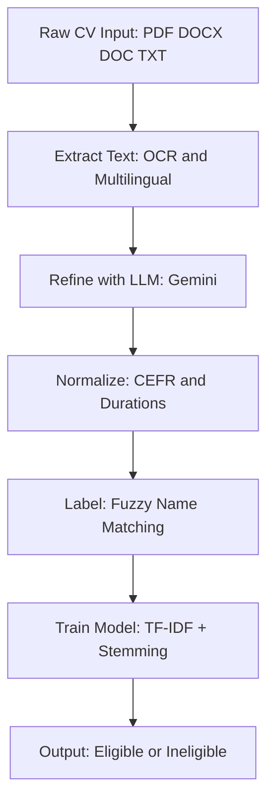

# CV Recruitment Predictor

[](https://www.python.org/downloads/release/python-3110/)
[](https://opensource.org/licenses/MIT)
[](https://github.com/franjgs/cv-recruitment-predictor)

A machine learning-based system to predict the **eligibility** of a CV for the recruitment process by extracting and analyzing key information from resumes in PDF, DOCX, DOC, or TXT formats. Supports both Spanish and English CVs with multilingual OCR, robust language detection, and stemming.

## Objective

The primary goal of this project is to automate the initial screening of job candidates by predicting their eligibility for recruitment based on pre-selection CV content. The system extracts relevant data (e.g., name, email, education, work experience) from CVs, processes it using natural language processing (NLP) techniques, refines it with an LLM for semantic understanding, labels outcomes, and trains a hybrid model to classify candidates as eligible or ineligible. Handles scanned PDFs with OCR and supports multilingual content (Spanish/English) with improved language detection and stemming.

## Methodology

The pipeline follows a structured four-phase approach to handle CV data:

1. **Extraction Phase**:
   - **Purpose**: Extract normalized raw text from CVs (PDF, DOCX, DOC, TXT).
   - **Process**: The `extract.py` script uses `pytesseract` (with `pdf2image`) for OCR on PDFs, supporting Spanish and English (`lang='spa+eng'`). Generates `raw_text` in lowercase, removing irrelevant text (e.g., "currículum vítae", page numbers) while preserving key characters (@, -, /, :, , , 0-9). Detects prominent names in uppercase headers and identifies language (ES/EN/mixed) using a robust keyword-based approach (e.g., "educación", "skills"). Structure is left empty for LLM filling.
   - **Output**: Raw extraction JSONs in `data/extracted_output/`.

2. **Refinement Phase**:
   - **Purpose**: Use LLM to fill and enrich the CV structure from `raw_text`.
   - **Process**: The `refine_cv.py` script employs the Google Gemini API (`gemini-1.5-flash`) via `refine_cv_with_llm` to parse the `raw_text`, correct OCR errors, and populate fields (e.g., `personal_information`, `languages`, `education`). LLM output is saved in `data/processed/`.
   - **Advantage**: Leverages AI to handle contextual data and improve accuracy for multilingual CVs.

3. **Normalization/Refinement Phase**:
   - **Purpose**: Standardize and refine LLM output (e.g., map language levels to CEFR, calculate durations).
   - **Process**: The `structure.py` script processes the LLM output with `normalize_llm_cv_output`, mapping language levels (e.g., 'alto/advanced' to 'C1'), calculating durations for education/experience, and removing duplicates. Supports ES/EN terms. Final data is saved in `data/refined/`.
   - **Output**: Fully processed JSONs ready for labeling and modeling.

4. **Labeling and Training Phase**:
   - **Purpose**: Label CVs based on selected candidates and train ML models for prediction.
   - **Process**: The `preprocess.py` and `test_label_all_cvs.py` scripts match CV names against `MASIYY_Role.csv` files in `data/selected/` using fuzzy normalization (handles tildes, name orders). Outputs `data/labels.csv` with `filename`, `name`, `hiring_outcome`. The `train_model.py` script uses TF-IDF vectorization (separate or combined modes) with multilingual stemming, extracts numerical features (e.g., `fit_score`, durations), and trains models (Logistic Regression or Random Forest based on dimensionality). Outputs models in `output/models/`.
   - **Output**: `labels.csv`, trained models (`recruitment_model.pkl`), metrics (`model_metrics.json`).

The pipeline integrates these phases in `test_refine_all_cvs.py`, which orchestrates extraction, refinement, and normalization, saving intermediate results while performing debug prints for verification (ideal for Spyder). `test_extract_cv.py` is used for standalone extraction testing, `test_label_all_cvs.py` for labeling, and `test_train_model.py` for training.

### Pipeline Diagram



## Example Output

After extraction (`data/extracted_output/example_extracted_raw.json`):

```json
{
    "raw_text": "juan pérez. email: juan@example.com educación: universidad de madrid (2010-2014)...",
    "full_name_from_header": "JUAN PÉREZ",
    "detected_language": "es",
    "personal_information": {
        "full_name": "",
        "email": "",
        ...
    }
}
```

After normalization (`data/refined/example_refined.json`):

```json
{
    "languages": [{"language": "español", "level": "nativo"}, {"language": "english", "level": "c1"}],
    "education": [{"institution": "Universidad de Madrid", "duration_years": 4}],
    "processed_and_standardized": true
}
```

After labeling (`data/labels.csv`):

```csv
filename,name,hiring_outcome
example_cv,Susana Pastor Moreno,1
```

## Vectorization Modes

- **Separate**: Vectorizes sections (`education`, `work_experience`, `knowledge_and_tools`, `languages`) independently with TF-IDF (max 200/100 features per section). Useful for analyzing section-specific importance.
- **Combined**: Concatenates all text fields into one and applies TF-IDF (max 1000 features). Captures broader context.

## Tools and Technologies

- **Programming Language**: Python 3.11, executed and debugged with Spyder.
- **Libraries**:
  - `pytesseract` and `pdf2image`: For OCR and PDF-to-image conversion (multilingual with `spa+eng`).
  - `pandas`: For data manipulation and labeling.
  - `unicodedata`: For normalizing characters (e.g., tildes).
  - `json`: For data serialization.
  - `google.generativeai`: For LLM-based refinement with Gemini API.
  - `re`: For regular expression-based text parsing and language detection.
  - `os`: For file and directory handling.
  - `docx` (python-docx): For DOCX extraction.
  - `pandoc` (system tool): For .DOC fallback.
  - `scikit-learn`: For TF-IDF vectorization, model training, and evaluation.
  - `nltk`: For multilingual stemming (Spanish/English).
  - `joblib`: For saving models and artifacts.
  - `scipy`: For sparse matrix operations.
- **Version Control**: Git, with a `.gitignore` configured to exclude `data/`, `.DS_Store`, and `Icon` files, except for `data/labels.csv`.
- **Environment**: Managed with a virtual environment (`venv/`) or Conda, and environment variables (e.g., `API_KEY_GEMINI`).

## Directory Structure

```
CV-prediction/
├── data/
│   ├── raw/                 # Original CVs (PDF, DOCX, DOC, TXT)
│   ├── extracted_output/    # Raw extraction JSONs from test_extract_cv.py
│   ├── processed/           # LLM-refined JSONs from test_refine_all_cvs.py
│   ├── refined/             # Normalized/refined JSONs after structure.py
│   ├── selected/            # Selected data (MASIYY_Role.csv files)
│   └── labels.csv           # Labels for hiring outcomes (filename, name, hiring_outcome)
├── output/
│   ├── logs/                # Execution logs and metrics (model_metrics.json)
│   └── models/              # Trained models (recruitment_model.pkl, artifacts.pkl)
├── src/                     # Main scripts
│   ├── extract.py           # Raw text extraction (multilingual)
│   ├── preprocess.py        # Label generation
│   ├── refine_cv.py         # LLM refinement
│   ├── structure.py         # Normalization/refinement (ES/EN maps)
│   └── train_model.py       # Model training logic
├── tests/                   # Unit tests
│   ├── test_extract.py      # Extraction test
│   └── test_preprocess.py   # Preprocessing test
├── .gitignore               # Ignores data/, .DS_Store, Icon (except labels.csv)
├── README.md                # Project documentation
├── requirements.txt         # Dependencies
├── test_extract_cv.py       # Standalone extraction test
├── test_refine_all_cvs.py   # Main pipeline script
├── test_label_all_cvs.py    # Labeling script
└── test_train_model.py      # Model training test
```

## Installation

1. Clone the repository:
   ```bash
   git clone https://github.com/franjgs/cv-recruitment-predictor.git
   cd cv-recruitment-predictor
   ```
2. Set up a virtual environment:
   ```bash
   python -m venv venv
   source venv/bin/activate  # On Windows: venv\Scripts\activate
   ```
3. Install dependencies:
   ```bash
   pip install -r requirements.txt
   ```
   (Required: `pytesseract pdf2image pandas unicodedata json google-generativeai re python-docx python-dotenv scikit-learn nltk joblib scipy`. For .DOC: Install system `pandoc`.)
4. Configure the Gemini API key:
   ```bash
   export API_KEY_GEMINI="your_api_key_here"
   ```
   or create a `.env` file with `API_KEY_GEMINI=your_api_key_here` and install `python-dotenv`.
5. Download NLTK data for multilingual stemming:
   ```bash
   python -c "import nltk; nltk.download('snowball_data')"
   ```
6. Run the pipeline:
   ```bash
   %runfile test_refine_all_cvs.py  # In Spyder, from project root
   ```

## Usage

- Place CV files in `data/raw/`.
- Run `test_extract_cv.py` to generate raw extraction JSONs in `data/extracted_output/` (check console for language detection with keyword counts).
- Run `test_refine_all_cvs.py` to refine with LLM (in `data/processed/`) and normalize/refine (in `data/refined/` via `structure.py`).
- Place selected candidates' CSVs (e.g., `MASI09_Becarios.csv`) in `data/selected/`.
- Run `test_label_all_cvs.py` to generate `data/labels.csv` with hiring outcomes.
- Run `test_train_model.py` to train and evaluate the model (separate and combined modes).
- Check `data/labels.csv` for hiring outcome labels and `output/logs/model_metrics.json` for training results.

## Troubleshooting

- **OCR fails on scanned PDFs**: Ensure Tesseract is installed (e.g., `brew install tesseract` on macOS) and lang data for `spa+eng` (`tesseract --list-langs`). Increase DPI (e.g., 400) if text is tiny.
- **DOCX/DOC errors**: Install `python-docx` for DOCX; for .DOC, install system `pandoc` or convert manually to PDF.
- **NLTK download fails**: Run manually in Spyder: `nltk.download('snowball_data')`. Required for multilingual stemming.
- **Gemini API rate limits**: Add retries in `refine_cv.py` if processing many CVs.
- **Language detection issues**: Check `detected_language` and keyword counts in `data/extracted_output/` JSONs. Add specific terms to `spanish_keywords` or `english_keywords` in `extract.py` if needed.
- **Training errors**: Ensure `labels.csv` has both 0 and 1 outcomes. Use `vectorization_mode='combined'` for small datasets.

## Contributing

Feel free to fork this repository, submit issues, or pull requests. Ensure changes align with the methodology and toolset described. Use English for docstrings and comments in code.

## License

This project is licensed under the MIT License - see the [LICENSE](LICENSE) file for details.